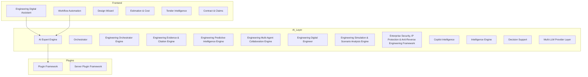

# Sarathi AI Architecture

```mermaid
graph TB
  subgraph Frontend
    assistant[Engineering Digital Assistant]
    workflows[Workflow Automation]
    design[Design Wizard]
    estimation[Estimation & Cost]
    tender[Tender Intelligence]
    contracts[Contract & Claims]
  end
  subgraph AI_Layer
    ai[AI Expert Engine]
    orchestrator[Orchestrator]
    engineering-orchestrator-engine[Engineering Orchestrator Engine]
    engineering-evidence-citation-engine[Engineering Evidence & Citation Engine]
    engineering-predictive-intelligence[Engineering Predictive Intelligence Engine]
    engineering-multi-agent-collaboration[Engineering Multi-Agent Collaboration Engine]
    engineering-digital-engineer[Engineering Digital Engineer]
    engineering-simulation-scenario-analysis[Engineering Simulation & Scenario Analysis Engine]
    enterprise-security-ip-protection[Enterprise Security, IP Protection & Anti-Reverse Engineering Framework]
    copilot[Copilot Intelligence]
    intelligence[Intelligence Engine]
    decision-support[Decision Support]
    backend-ai[Multi-LLM Provider Layer]
  end
  subgraph Plugins
    plugins[Plugin Framework]
    backend-plugins[Server Plugin Framework]
  end
  ai --> plugins
  assistant --> ai
  workflows --> ai
```